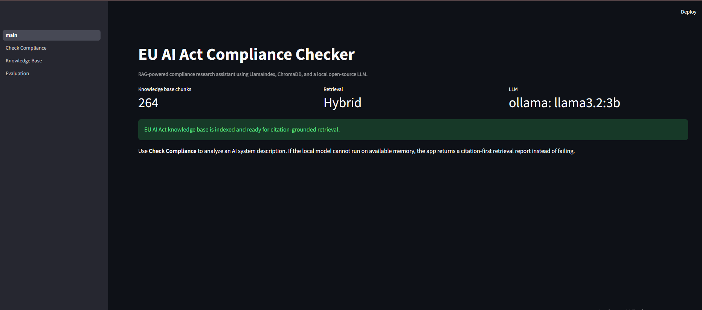

# EU AI Act Compliance Checker


Everyone is racing to build AI.
But before an AI system ships, one question matters:

**Is it compliant with the rules that govern it?**

This project is a RAG-powered compliance research assistant that checks AI system descriptions against the **EU Artificial Intelligence Act**. It retrieves relevant legal clauses from the official EU AI Act, analyzes the system with a local open-source LLM, and returns grounded findings with citations, risk levels, evidence, and remediation suggestions.

It is designed as a practical AI governance tool, not a toy chatbot.

> This project is a research and engineering prototype. It does not provide legal advice.

## Why This Project Matters

AI products are moving quickly, but regulation is now part of the product lifecycle. Teams building recruitment systems, biometric tools, scoring models, recommender systems, or decision-support software need to understand whether their AI system may be prohibited, high-risk, or subject to documentation and oversight obligations.

This project demonstrates how RAG can support that workflow:

- Ground LLM outputs in official regulatory text
- Retrieve exact Articles and Annexes from the EU AI Act
- Reduce hallucination with citations and hybrid retrieval
- Flag potential compliance risks before deployment
- Show the source text beside every finding

## Demo


Paste an AI system description such as:

```text
We are deploying an AI-powered biometric identification system in a shopping mall to identify banned individuals in real time using CCTV footage. The system compares faces against a private watchlist and alerts security staff when it finds a match.
```

The checker can return findings like:

```text
Article 5 | High
Possible prohibited or tightly restricted real-time biometric identification in a publicly accessible space.

ANNEX III | High
The system may fall within high-risk biometric identification use cases listed in Annex III.
```

Each finding includes:

- Relevant EU AI Act clause
- Risk level
- Evidence from the user description
- Recommended action
- Retrieved source excerpt
- Official EUR-Lex source link

## Core Features

- **EU AI Act knowledge base**
  - Uses official EUR-Lex HTML for Regulation (EU) 2024/1689.
  - Stores chunks in local ChromaDB.

- **Legal structure-aware chunking**
  - Splits the Act by Article and Annex.
  - Preserves metadata such as `section_type`, `section_number`, `source_url`, and `parent_section_number`.

- **Semantic sub-chunking**
  - Uses LlamaIndex semantic splitting inside each Article or Annex.
  - Improves retrieval precision while keeping legal citation context.

- **Hybrid retrieval**
  - Combines Chroma semantic retrieval with BM25 keyword retrieval.
  - Helps preserve exact legal terms such as `Article 5`, `Annex III`, `biometric identification`, and `employment`.

- **Local open-source LLM**
  - Uses Ollama with `llama3.2:3b` by default.
  - Supports hosted Mistral API as an optional fallback.

- **Compliance report generation**
  - Produces structured findings with clause, risk level, evidence, recommendation, and source excerpt.
  - Uses deterministic guardrails for obvious high-risk/prohibited scenarios such as biometric identification and recruitment AI.

- **Streamlit interface**
  - Upload or paste an AI system description.
  - Inspect retrieved legal excerpts directly in the UI.

## Tech Stack

| Layer | Tooling |
|---|---|
| Frontend | Streamlit |
| RAG orchestration | LlamaIndex |
| Vector database | ChromaDB |
| Keyword retrieval | BM25 via `rank-bm25` |
| Local LLM | Ollama + Llama 3.2 3B |
| Optional hosted LLM | Mistral API |
| Embeddings | `BAAI/bge-small-en-v1.5` |
| Parsing | BeautifulSoup, PyMuPDF |
| Validation | Pydantic |
| Testing | Pytest |

## Architecture

```text
User AI system description
        |
        v
Streamlit UI
        |
        v
Hybrid retrieval query
        |
        +--> Chroma semantic search
        |
        +--> BM25 keyword search
        |
        v
Fused retrieved EU AI Act chunks
        |
        v
Classification guardrails + local LLM analysis
        |
        v
Structured compliance report with citations
```

## RAG Pipeline

### 1. Source Ingestion

The knowledge base is built from the official EU AI Act source:

```text
https://eur-lex.europa.eu/legal-content/EN/TXT/HTML/?uri=OJ:L_202401689
```

The ingestion script downloads the HTML, extracts legal text, chunks it, embeds it, and stores it in ChromaDB.

```powershell
python scripts/ingest_eu_ai_act.py
```

### 2. Two-Stage Chunking

The project uses both legal and semantic chunking:

```text
EU AI Act HTML
    -> Article/Annex parent chunks
    -> Semantic sub-chunks
    -> Metadata-preserving vector records
```

This matters because legal documents have natural structure. A random fixed-token splitter can separate an obligation from its Article number or Annex context. This project keeps the legal citation attached to each semantic chunk.

Current indexed corpus:

```text
264 EU AI Act chunks
```

### 3. Hybrid Retrieval

Pure semantic retrieval can miss exact legal terms. Pure keyword search can miss paraphrased user descriptions. This project uses both:

```text
semantic score + BM25 score -> fused ranking
```

This helps queries like:

```text
AI system screens job applicants and ranks candidates
```

retrieve:

```text
ANNEX III
Article 10
Article 14
Article 15
```

## Guardrails

Small local models can produce useful analysis, but they can also soften or misframe legal risk. To reduce that, the project includes deterministic guardrails for high-signal scenarios.

Examples:

- Biometric identification in public or publicly accessible spaces
  - Prioritizes Article 5 and Annex III
  - Flags possible prohibited or tightly restricted use

- Recruitment and candidate screening
  - Prioritizes Annex III
  - Flags likely high-risk classification

This keeps the report from saying weak things like "no remediation needed" when the retrieved context indicates a serious compliance issue.

## Example Outputs

### Biometric Identification

Input:

```text
We are deploying an AI-powered biometric identification system in a shopping mall to identify banned individuals in real time using CCTV footage.
```

Output:

```text
Article 5 | High
Possible prohibited or tightly restricted real-time biometric identification in a publicly accessible space.

ANNEX III | High
The system may fall within high-risk biometric identification use cases listed in Annex III.
```

### HR Screening

Input:

```text
An AI system screens job applicants, analyzes CVs, ranks candidates, and recommends who should be invited to interview.
```

Expected retrieval focus:

```text
ANNEX III
Article 10
Article 11
Article 14
Article 15
```

## Repository Structure

```text
app/
  main.py                         Streamlit home page
  pages/
    1_Check_Compliance.py         Main compliance checker UI
    2_Knowledge_Base.py           Knowledge base ingestion/admin page
    3_Evaluation.py               Evaluation case viewer

src/
  analysis/                       LLM prompts, guardrails, compliance engine
  evaluation/                     Evaluation helpers and test case loading
  ingestion/                      HTML/PDF loading, legal chunking, index build
  reporting/                      Pydantic schemas and report formatting
  retrieval/                      ChromaDB, semantic retrieval, hybrid search

data/
  raw/                            Source EU AI Act HTML/PDF files
  processed/                      Processed chunks
  chroma_db/                      Local ChromaDB store
  eval/                           Evaluation examples

scripts/
  ingest_eu_ai_act.py             Build or rebuild the EU AI Act index

tests/
  test_chunking.py
  test_hybrid_search.py
  test_llm_client.py
  test_report_schema.py
  test_semantic_indexing.py
```

## Setup

### 1. Create Environment

```powershell
python -m venv .venv
.\.venv\Scripts\Activate.ps1
pip install -r requirements.txt
copy .env.example .env
```

### 2. Install Ollama

Download Ollama for Windows:

```text
https://ollama.com/download/windows
```

Pull the smaller local model:

```powershell
ollama pull llama3.2:3b
```

The app uses this model by default:

```text
LLM_PROVIDER=ollama
OLLAMA_MODEL=llama3.2:3b
```

### 3. Build Knowledge Base

```powershell
python scripts/ingest_eu_ai_act.py
```

### 4. Run App

```powershell
python run_app.py
```

Then open:

```text
http://localhost:8501
```

## Optional Mistral API

If you prefer hosted inference, set:

```text
LLM_PROVIDER=mistral
MISTRAL_API_KEY=your_key_here
MISTRAL_MODEL=mistral-small-latest
```

## Evaluation

The project includes early evaluation scaffolding:

- Retrieval test cases
- Expected regulatory topics
- Unit tests for chunking, hybrid retrieval, schema validation, and JSON parsing

Run tests:

```powershell
python -m pytest tests
```

Current test coverage:

```text
7 tests passing
```
## Skills Demonstrated

- Retrieval-augmented generation
- Legal/regulatory NLP
- LlamaIndex orchestration
- ChromaDB vector search
- Hybrid retrieval with BM25
- Semantic and structure-aware chunking
- Metadata-grounded citation design
- Local LLM deployment with Ollama
- Streamlit product prototyping
- Pydantic report schemas
- Test-driven RAG component validation

## Disclaimer

This project is a technical prototype for AI governance research and portfolio demonstration. It is not a substitute for legal counsel. The EU AI Act is complex, and real compliance decisions should involve qualified legal and regulatory experts.

